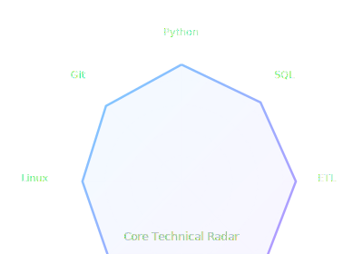
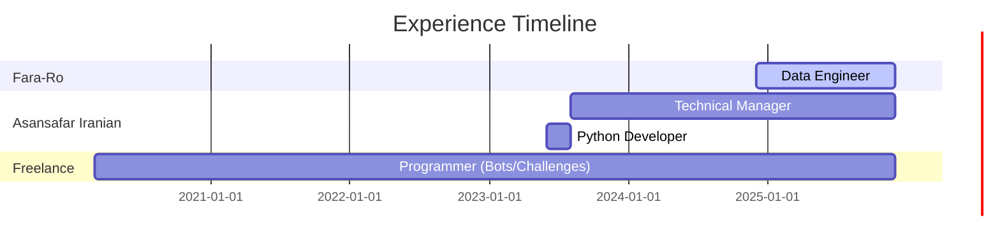
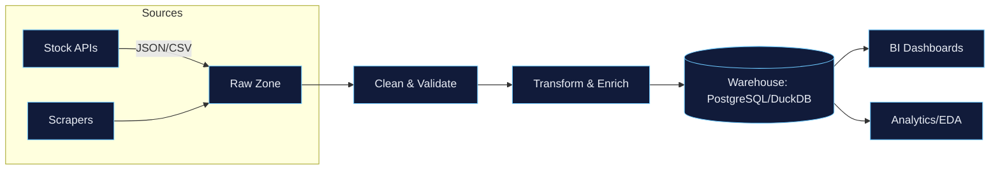
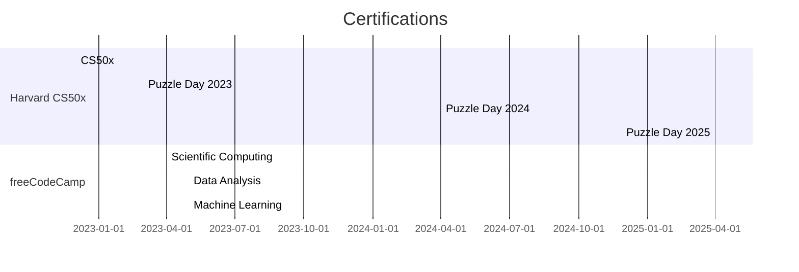

<!-- Profile README for SoheilGtex -->

  

  

  
  
  
  
  

---

## About
Data Engineer and Python developer specializing in **data acquisition, cleaning, and analytics**—primarily across **financial data** and **BI** workflows. I build **efficient ETL pipelines**, structure large datasets for analysis, and collaborate with analysts to deliver dashboards and decision-grade insights.  
**Open to**: remote roles and relocation (**Germany / Ireland**).  
**Contact**: [Email](mailto:Soheilsalmanisafarpour@gmail.com) · [LinkedIn](https://www.linkedin.com/in/soheil-salmani-822b89232) · [GitHub](https://github.com/SoheilGtex)

---

## Core Technical Snapshot

  

  

> **Stacks & Tools:** Python · SQL · Pandas · NumPy · Requests · Matplotlib · Seaborn · scikit-learn · ETL · BI · Data Cleaning/Wrangling · EDA · Linux/Bash · Git · Mathematics/Statistics

---

## Experience (timeline)

### Highlights
- **Data Engineer — Fara-Ro (Dec 2024 – Present, Tehran)**  
  Financial data sourcing (stock-market), automated ingestion pipelines (Python/SQL), EDA, BI support.
- **Technical Manager — Asansafar Iranian (Aug 2023 – Present)**  
  Built/led cross-functional tech team (web & mobile), set technical roadmap, governed quality & delivery.
- **Python Developer — Asansafar Iranian (Jun–Aug 2023)**  
  Refactored legacy Python codebase; implemented core logic for productization.
- **Freelance Programmer (Mar 2020 – Present)**  
  Bots/automation, CTF-style challenges (Natas, Project Euler). **Voice Cloning** project recognized by **Pardis Technology Park**.

---

## Projects
- **Voice Cloning (SV2TTS, Python)** — presented at **Pardis Technology Park** and showcased at **Crisis Management HQ** with UN representatives; media coverage: **IRIB Channel 1** (Jan 2023) & **IRIB Nasim, Exir Festival (2024)**.  
  *Repo:* [`voice-cloning-sv2tts-pro`](https://github.com/SoheilGtex/voice-cloning-sv2tts-pro)
- **Methane Gas Detection (Python)** — sensor-based prototype, presented in **Sampad** programming competitions.
- **Asansafar — Smart Urban Mobility** — technical direction and MVP; defended at **Tehran Municipality** panel (Oct 2023).
- **Finance Data Pipelines (Crypto/Markets)** — production-style ETL skeleton with validation & CLI.  
  *Repo:* [`finance-data-pipelines-pro-crypto`](https://github.com/SoheilGtex/finance-data-pipelines-pro-crypto)

### Data Pipeline Blueprint

---

## Education
- **B.Sc. Mathematics and Applications — Kharazmi University (Oct 2024 – Present)**  
  Core Council Member of the **Mathematics Scientific Association**; Member of the **AI Society**.
- **Diploma in Mathematics & Physics — Sampad (Sep 2018 – Jul 2024)**

---

## Certifications (timeline)

> Also: Microsoft Learn; Udemy (Python, Git); Mimo (Python/SQL); Raymand Robot (LOGIC, KAIROBOT 3).

---

## Languages
**English** (Professional Working) · **German** (Limited Working) · **Persian** (Native/Bilingual)

---

## Contact
- 📧 **Email**: [Soheilsalmanisafarpour@gmail.com](mailto:Soheilsalmanisafarpour@gmail.com)  
- 🌍 **Location**: Tehran, Iran  
- 🔗 **Profiles**: [LinkedIn](https://www.linkedin.com/in/soheil-salmani-822b89232) · [GitHub](https://github.com/SoheilGtex)

---

### Extras (optional visuals)

  
  

  

  

<!-- Footer line -->

  

