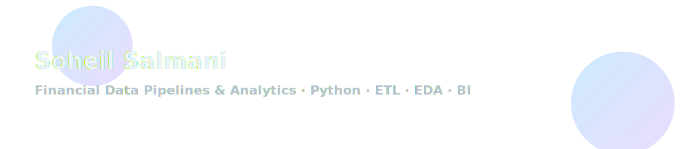
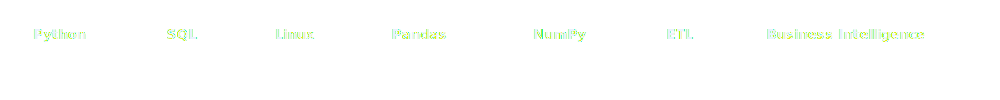
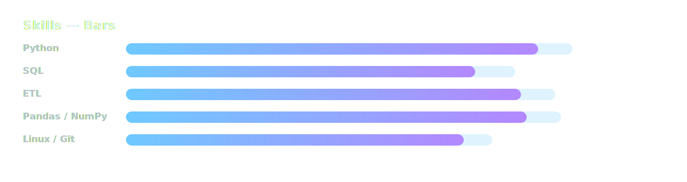
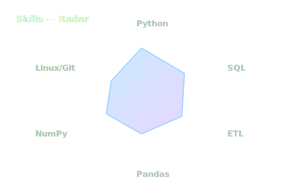

<!-- Glassy README for SoheilGtex -->

<picture>
  <source media="(prefers-color-scheme: dark)" srcset="assets/header-glass-dark.svg">
  <source media="(prefers-color-scheme: light)" srcset="assets/header-glass-light.svg">
  
</picture>

  <a href="https://www.linkedin.com/in/soheil-salmani-822b89232" target="_blank"><b>LinkedIn</b></a> ·
  <a href="https://github.com/SoheilGtex" target="_blank"><b>GitHub</b></a> ·
  <a href="https://soheilgtex.github.io" target="_blank"><b>Resume (Site)</b></a>

---

### About

Data engineer and Python developer focused on **financial-data pipelines**, **ETL/EDA**, and **BI workflows**.  
I build efficient data ingestion → cleaning → structuring → analytics pipelines and collaborate with analysts to deliver dashboards and decision-grade insights.

- Open to **remote** roles and **relocation** (Germany / Ireland).
- Interests: **Data Engineering**, **Analytics**, **Automation**, **Scientific Python**.

---

### Core Stack

<picture>
  <source media="(prefers-color-scheme: dark)" srcset="assets/chips-banner-dark.svg">
  <source media="(prefers-color-scheme: light)" srcset="assets/chips-banner-light.svg">
  
</picture>

---

### Skills Overview

<picture>
  <source media="(prefers-color-scheme: dark)" srcset="assets/skills-bars-glass-dark.svg">
  <source media="(prefers-color-scheme: light)" srcset="assets/skills-bars-glass-light.svg">
  
</picture>

<picture>
  <source media="(prefers-color-scheme: dark)" srcset="assets/skills-radar-glass-dark.svg">
  <source media="(prefers-color-scheme: light)" srcset="assets/skills-radar-glass-light.svg">
  
</picture>

---

### Selected Projects

- **Voice Cloning (SV2TTS, Python)** — Presented at Pardis Technology Park; showcased at the Crisis Management Headquarters with UN representatives. Media: IRIB Channel 1 (Jan 2023) & IRIB Nasim (Exir Festival, 2024).
- **Methane Gas Detection (Python)** — Sensor-based prototype with threshold logic; presented in Sampad programming competitions.
- **Asansafar — Smart Urban Mobility** — Defined technical direction; prepared MVP; defended at Tehran Municipality panel (Oct 2023).

---

### Education & Certifications

**B.Sc. in Mathematics and Applications** — Kharazmi University (Oct 2024 – Present).  
Core Council Member, Mathematics Scientific Association · Member, AI Society.

**Certifications (selection):**
- CS50x Puzzle Day 2025 / 2024 — Harvard University  
- Scientific Computing with Python — freeCodeCamp  
- Machine Learning with Python — freeCodeCamp  
- CS50x — Harvard/CS50  
- Microsoft Learn · Udemy (Git / Python)

---

### Contributions

<picture>
  <source media="(prefers-color-scheme: dark)" srcset="https://raw.githubusercontent.com/SoheilGtex/SoheilGtex/output/github-contribution-grid-snake-dark.svg">
  <source media="(prefers-color-scheme: light)" srcset="https://raw.githubusercontent.com/SoheilGtex/SoheilGtex/output/github-contribution-grid-snake.svg">
  
</picture>

  
  

© 2025 Soheil Salmani · <a href="https://soheilgtex.github.io">Portfolio</a>

