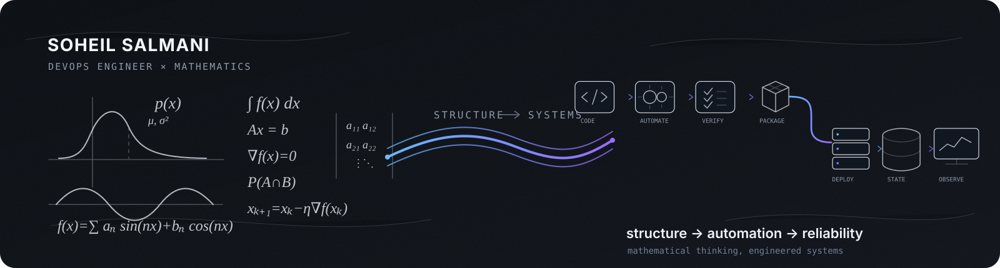

<p align="center">
  
</p>

<p align="center">
  <a href="https://www.linkedin.com/in/soheil-salmani-822b89232"><b>LinkedIn</b></a>
  &nbsp;&nbsp;·&nbsp;&nbsp;
  <a href="https://soheilgtex.github.io"><b>Portfolio</b></a>
  &nbsp;&nbsp;·&nbsp;&nbsp;
  <a href="https://github.com/SoheilGtex?tab=repositories"><b>Repositories</b></a>
</p>

> **I like problems that have both a proof-shaped side and a production-shaped side.**

I'm **Soheil Salmani**, a DevOps Engineer and Mathematics undergraduate at Kharazmi University.

My path has moved through Python/backend development, technical leadership, data engineering, analytics, and now DevOps/DevSecOps. The titles changed; the thread did not: I like understanding complicated systems, reducing them to something precise, and making them dependable.

Mathematics is not a decorative line on my profile. It is how I think about structure, approximation, uncertainty, and trade-offs. Engineering is where I test those ideas against the real world.

<br>

<table>
<tr>
<td width="33%" valign="top">

### Mathematics

Numerical analysis  
Probability & statistics  
Linear algebra  
Differential equations  
Mathematical modeling  
Optimization

</td>
<td width="33%" valign="top">

### Systems

Linux  
Docker  
CI/CD  
GitHub Actions  
DevSecOps  
Application security

</td>
<td width="33%" valign="top">

### Software & data

Python  
FastAPI  
PostgreSQL  
SQL  
REST APIs  
Data pipelines

</td>
</tr>
</table>

## The path so far

```text
Python / backend  →  technical leadership  →  data engineering  →  analytics  →  DevOps / DevSecOps
```

Different roles, same preference: **make the system understandable first, then make it reliable.**

## Where I am now

- **DevOps Engineer at Fara-Ro** — infrastructure, CI/CD, secure delivery, testing, and reliability around Python/FastAPI systems.
- **B.Sc. Mathematics and Applications at Kharazmi University** — with a growing Computer Science foundation and a strong interest in computational mathematics.
- **Teaching Assistant at Kharazmi University** — supporting mathematical and computational courses across programming, mathematical software, probability, and statistics.

## Tools I reach for

<p align="center">
  
</p>

<p align="center">
  <code>FastAPI</code>&nbsp;&nbsp;
  <code>SQLAlchemy</code>&nbsp;&nbsp;
  <code>REST APIs</code>&nbsp;&nbsp;
  <code>R</code>&nbsp;&nbsp;
  <code>MATLAB</code>&nbsp;&nbsp;
  <code>NumPy</code>&nbsp;&nbsp;
  <code>Pandas</code>&nbsp;&nbsp;
  <code>LaTeX</code>
</p>

## How I work

- Understand the system before automating it.
- Prefer observable failures to silent ones.
- Automate repetition, not thinking.
- Measure first; optimize second.
- Keep the implementation simpler than the diagram whenever possible.

## Beyond engineering

I also spend time teaching and contributing to the academic community at Kharazmi University. I serve as an elected council member of the **Mathematics Scientific Association** and as a member of the **Artificial Intelligence Association**.

<details>
<summary><b>A few things from earlier chapters</b></summary>
<br>

- Top Inventor and Researcher · Pardis Technology Park · 2023, 2024
- Best Research Project · 2023
- Best Programming Project · 2022, 2023
- Best Programmer · 2022
- CS50x Puzzle Day · 2023, 2024, 2025

</details>

---

<p align="center">
  <b>The implementation details live in the pinned repositories.</b><br>
  <sub>This page is the map, not the archive.</sub>
</p>
