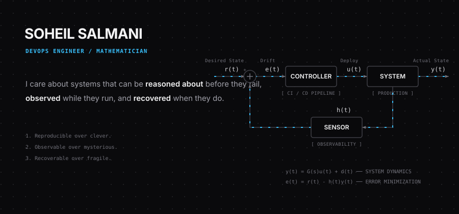
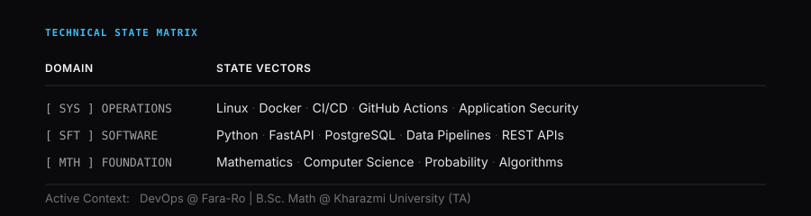

<picture>
  <source media="(prefers-color-scheme: dark)" srcset="assets/hero-dark.svg">
  <source media="(prefers-color-scheme: light)" srcset="assets/hero-light.svg">
  
</picture>

 

  <a href="https://www.linkedin.com/in/soheil-salmani-822b89232" target="_blank"><b>LinkedIn</b></a>
  &nbsp;&nbsp;·&nbsp;&nbsp;
  <a href="https://soheilgtex.github.io" target="_blank"><b>Portfolio</b></a>
  &nbsp;&nbsp;·&nbsp;&nbsp;
  <a href="https://github.com/SoheilGtex?tab=repositories"><b>Repositories</b></a>

 

My path into infrastructure came through backend architecture, data pipelines, and technical leadership. That trajectory shaped a specific view of operations: **infrastructure is part of the software system, not a separate domain.**

I approach systems engineering the way I approach mathematics—by defining constraints, minimizing uncertainty, and making state explicit. 

Currently working as a DevOps Engineer at Fara-Ro while completing a B.Sc. in Mathematics and Applications at Kharazmi University.

 

<picture>
  <source media="(prefers-color-scheme: dark)" srcset="assets/state-vector-dark.svg">
  <source media="(prefers-color-scheme: light)" srcset="assets/state-vector-light.svg">
  
</picture>

   
  <b>The pinned repositories carry the implementation details.</b>

