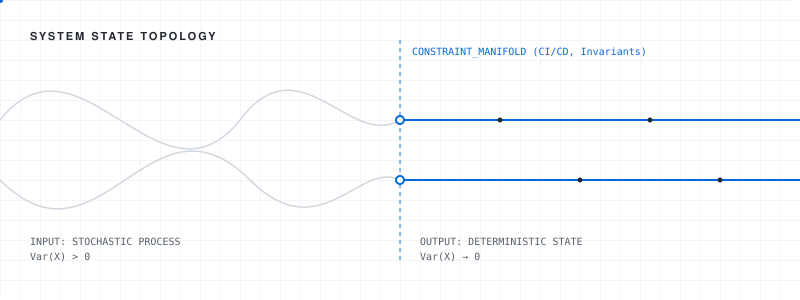

<picture>
  <source media="(prefers-color-scheme: dark)" srcset="./assets/trajectory-dark.svg">
  <source media="(prefers-color-scheme: light)" srcset="./assets/trajectory-light.svg">
  
</picture>

 
 

### Soheil Salmani
**DevOps Engineer • Systems • Mathematics**

---

I build deterministic systems in probabilistic environments.

Currently working in **DevOps and Infrastructure** at Fara-Ro, focusing on deployment reliability, application security, and CI/CD architecture. My approach is rooted in my academic background in **Mathematics**—treating infrastructure not merely as configuration scripts, but as state spaces governed by strict constraints, invariants, and convergence properties.

The progression of my work is deliberate:

**Python Backend** &nbsp; ↦ &nbsp; **Data Engineering** &nbsp; ↦ &nbsp; **DevOps & DevSecOps**

Every transition has been driven by the same fundamental objective: enforcing mathematical structure and reliability on complex, moving systems.

 

#### Core Domains

- **Infrastructure & Reliability:** Linux, Docker, CI/CD, GitHub Actions, Automated Testing, Server Hardening.
- **Software & Data:** Python, PostgreSQL, FastAPI, Data Pipelines, ETL.
- **Computational:** Mathematical Modeling, Probability, Linear Algebra, Statistical Analysis.

*The pinned repositories carry the implementation details.*

 

  <a href="https://soheilgtex.github.io">Portfolio</a> &nbsp;·&nbsp;
  <a href="https://www.linkedin.com/in/soheil-salmani-822b89232">LinkedIn</a>

