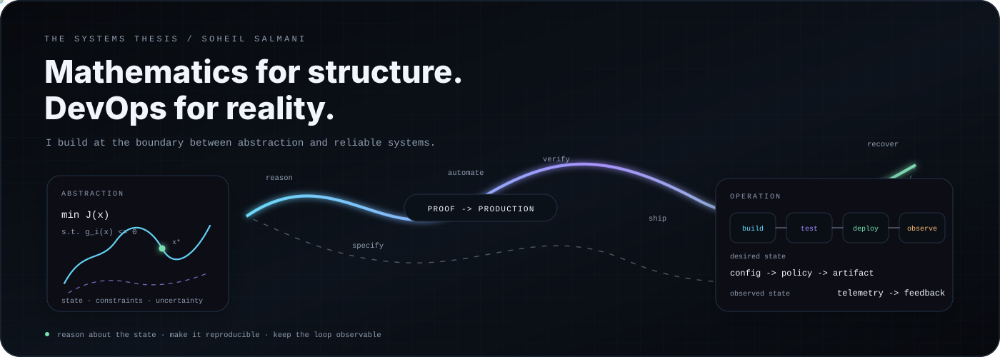

<picture>
  <source media="(prefers-color-scheme: dark)" srcset="assets/state-thesis-dark.svg">
  <source media="(prefers-color-scheme: light)" srcset="assets/state-thesis-light.svg">
  
</picture>

  <a href="https://www.linkedin.com/in/soheil-salmani-822b89232"><b>LinkedIn</b></a>
  &nbsp;&nbsp;·&nbsp;&nbsp;
  <a href="https://soheilgtex.github.io"><b>Portfolio</b></a>
  &nbsp;&nbsp;·&nbsp;&nbsp;
  <a href="https://github.com/SoheilGtex?tab=repositories"><b>Repositories</b></a>

 

## 01 / Thesis

I'm **Soheil Salmani** — a DevOps Engineer at **Fara-Ro** and a Mathematics and Applications undergraduate at **Kharazmi University**, with a secondary focus on Computer Science.

I don't see mathematics and systems engineering as separate interests. Mathematics gives me a language for **state, structure, constraints, uncertainty, and convergence**. Engineering is where those ideas meet changing environments, imperfect inputs, failure modes, and operational reality.

> I care about systems that can be reasoned about before they fail, observed while they run, and recovered when they do.

My path into DevOps came through Python/backend work, technical leadership, data engineering, and analytics. That history matters: I tend to look at infrastructure as part of a larger software and data system, not as a layer that begins after the application is written.

## 02 / Operating model

<picture>
  <source media="(prefers-color-scheme: dark)" srcset="assets/operating-model-dark.svg">
  <source media="(prefers-color-scheme: light)" srcset="assets/operating-model-light.svg">
  
</picture>

## 03 / Current coordinates

<table>
<tr>
<td width="50%" valign="top">

**Engineering**

DevOps / DevSecOps work around Linux and Docker environments, CI/CD, application security, automated testing, deployment reliability, and Python/FastAPI-based systems.

</td>
<td width="50%" valign="top">

**Mathematics + CS**

B.Sc. in Mathematics and Applications, with a growing Computer Science foundation and continuing interest in algorithms, numerical methods, probability, optimization, scientific computing, and data-intensive systems.

</td>
</tr>
</table>

I also serve as a **Teaching Assistant at Kharazmi University**. Teaching keeps the academic side of my work concrete: explain the idea, make the assumptions visible, and test whether the explanation survives contact with another person.

## 04 / Working languages

`Linux` `Docker` `Git` `GitHub Actions` `CI/CD` `Bash` `DevSecOps` `Application Security`

`Python` `FastAPI` `PostgreSQL` `SQL` `SQLAlchemy` `REST APIs` `Redis` `Prefect`

`R` `MATLAB` `LaTeX` `Numerical Analysis` `Probability` `Linear Algebra` `Algorithms`

## 05 / What I optimize for

**Reproducible over clever.** A result is more useful when someone else can obtain it.

**Observable over mysterious.** If a system matters, its state should not be hidden.

**Measured over assumed.** Intuition is useful; evidence decides.

**Recoverable over fragile.** Failure is part of the model, not an exception to it.

**Simple enough to explain.** Complexity should earn its place.

---

  <b>The pinned repositories carry the implementation details.</b> 
  LinkedIn has the chronology. This page is the thesis.

