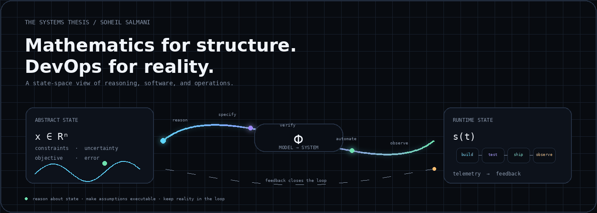
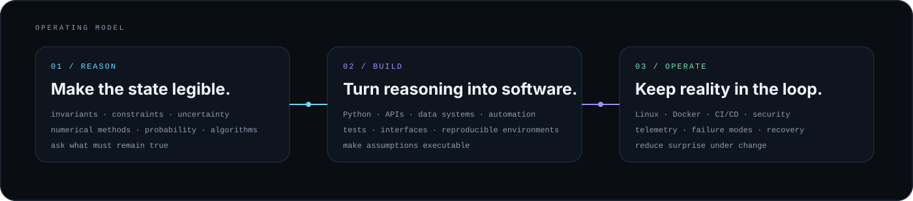
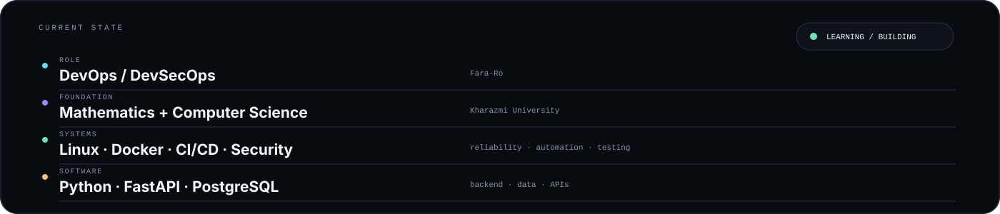
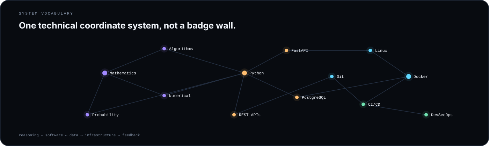

<picture>
  <source media="(prefers-color-scheme: dark)" srcset="assets/systems-thesis-dark.gif">
  <source media="(prefers-color-scheme: light)" srcset="assets/systems-thesis-light.gif">
  
</picture>

  <a href="https://www.linkedin.com/in/soheil-salmani-822b89232"><b>LinkedIn</b></a>
  &nbsp;&nbsp;·&nbsp;&nbsp;
  <a href="https://soheilgtex.github.io"><b>Portfolio</b></a>
  &nbsp;&nbsp;·&nbsp;&nbsp;
  <a href="https://github.com/SoheilGtex?tab=repositories"><b>Repositories</b></a>

 

## 01 / Thesis

I'm **Soheil Salmani**, a DevOps Engineer and Mathematics and Applications undergraduate at **Kharazmi University**, with a secondary focus on Computer Science.

I like problems that have both a formal side and an operational side: where **state, assumptions, error, constraints, and failure** can be made explicit.

> **I care about systems that can be reasoned about before they fail, observed while they run, and recovered when they do.**

My path into DevOps came through Python/backend work, technical leadership, data engineering, and analytics. That history still shapes how I work: infrastructure is part of the software system, not something that begins after the application is written.

## 02 / Operating model

<picture>
  <source media="(prefers-color-scheme: dark)" srcset="assets/operating-model-dark.svg">
  <source media="(prefers-color-scheme: light)" srcset="assets/operating-model-light.svg">
  
</picture>

## 03 / Current state

<picture>
  <source media="(prefers-color-scheme: dark)" srcset="assets/current-state-dark.svg">
  <source media="(prefers-color-scheme: light)" srcset="assets/current-state-light.svg">
  
</picture>

I also serve as a **Teaching Assistant at Kharazmi University**. Teaching keeps the academic side of my work concrete: if an idea cannot be explained clearly, its assumptions probably are not clear enough yet.

## 04 / System vocabulary

<picture>
  <source media="(prefers-color-scheme: dark)" srcset="assets/system-vocabulary-dark.svg">
  <source media="(prefers-color-scheme: light)" srcset="assets/system-vocabulary-light.svg">
  
</picture>

## 05 / Principles

**Reproducible over clever.** If someone else cannot obtain the result, it is difficult to trust.

**Observable over mysterious.** Important state should be visible.

**Recoverable over fragile.** Failure belongs in the model.

---

  <b>The pinned repositories carry the implementation details.</b> 
  LinkedIn has the chronology. This page is the mental model.

