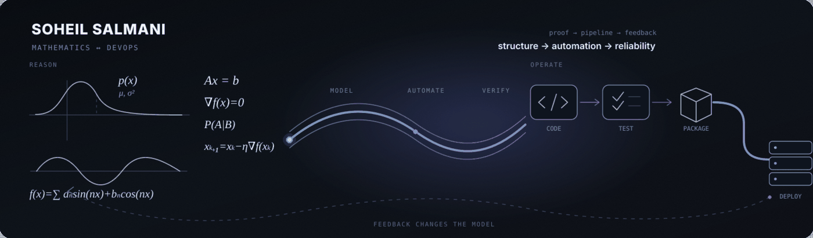
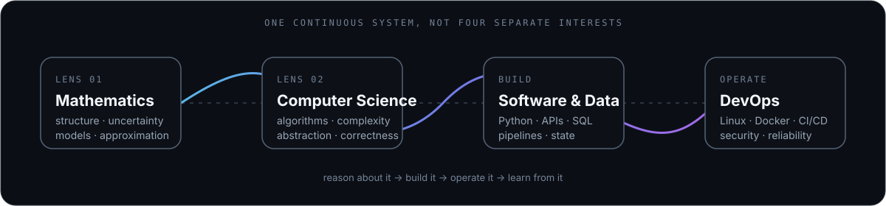

<picture>
  <source media="(prefers-color-scheme: dark)" srcset="assets/proof-to-production-dark.gif">
  <source media="(prefers-color-scheme: light)" srcset="assets/proof-to-production-light.gif">
  
</picture>

<p align="center">
  <a href="https://www.linkedin.com/in/soheil-salmani-822b89232"><b>LinkedIn</b></a>
  &nbsp;&nbsp;·&nbsp;&nbsp;
  <a href="https://soheilgtex.github.io"><b>Portfolio</b></a>
  &nbsp;&nbsp;·&nbsp;&nbsp;
  <a href="https://github.com/SoheilGtex?tab=repositories"><b>Repositories</b></a>
</p>

<br>

## Two lenses, one way of thinking

> **Math asks: _what must be true?_**  
> **DevOps asks: _what still works when things go wrong?_**

I like the overlap.

I'm **Soheil Salmani**, a DevOps Engineer and Mathematics undergraduate at Kharazmi University. Mathematics trained me to look for structure, invariants, edge cases, uncertainty, and proof. Engineering makes me test those habits against systems that have users, state, failures, deadlines, and consequences.

Most of my work lives somewhere between **Linux, containers, CI/CD, Python services, data systems, testing, security, and reliability**. My academic side keeps pulling me toward **numerical analysis, probability, linear algebra, algorithms, optimization, and scientific computing**.

<p align="center">
  
</p>

## 2026 snapshot

<table>
<tr>
<td width="50%" valign="top">

### Building

`Linux` · `Docker` · `CI/CD` · `GitHub Actions`  
`Python` · `FastAPI` · `PostgreSQL` · `Git`  
`DevSecOps` · `Application Security` · `Testing`

</td>
<td width="50%" valign="top">

### Academic foundation

`Numerical Analysis` · `Probability & Statistics`  
`Linear Algebra` · `Algorithms` · `Differential Equations`  
`Combinatorics` · `Mathematical Software`

</td>
</tr>
</table>

- **DevOps Engineer at Fara-Ro**
- **B.Sc. Mathematics and Applications at Kharazmi University**
- **Teaching Assistant at Kharazmi University**
- **Council Member, Mathematics Scientific Association**

<sub>I keep this section deliberately annual. One refresh a year is enough; the repositories carry the day-to-day detail.</sub>

## The path

```text
Python / backend
      ↓
technical leadership
      ↓
data engineering
      ↓
analytics
      ↓
DevOps / DevSecOps
```

The job titles changed. The recurring problem did not: **take something complicated, understand its structure, then make it dependable.**

## A few rules I keep

```text
reproducible  > clever
observable    > mysterious
measured      > assumed
simple        > impressive-looking
recoverable   > fragile
```

Automation should remove repetition, not judgment. Metrics should answer a question. Security should be part of the system, not a patch at the end. And if a diagram is much more complicated than the implementation needs to be, I probably drew the wrong diagram.

## Toolbox

<table>
<tr>
<td valign="top" width="33%">

**Systems**  
Linux · Docker · Bash  
GitHub Actions · CI/CD  
DevSecOps · Hardening

</td>
<td valign="top" width="33%">

**Software & Data**  
Python · FastAPI · SQLAlchemy  
PostgreSQL · Redis · REST APIs  
NumPy · Pandas · Prefect

</td>
<td valign="top" width="33%">

**Mathematical Computing**  
R · MATLAB · LaTeX  
Numerical methods  
Probability · Modeling

</td>
</tr>
</table>

<details>
<summary><b>Earlier chapters</b></summary>
<br>

Before DevOps, I worked across Python backend development, technical leadership, financial-data engineering, and analytics. I have also taught programming and robotics, and I continue to teach and support mathematical/computational coursework at university.

Some older recognitions include **Top Inventor and Researcher** (2023, 2024), **Best Research Project** (2023), **Best Programming Project** (2022, 2023), **Best Programmer** (2022), and **CS50x Puzzle Day** participation across 2023–2025.

</details>

---

<p align="center">
  <b>The pinned repositories are the evidence.</b><br>
  <sub>This README is only the coordinate system.</sub>
</p>
