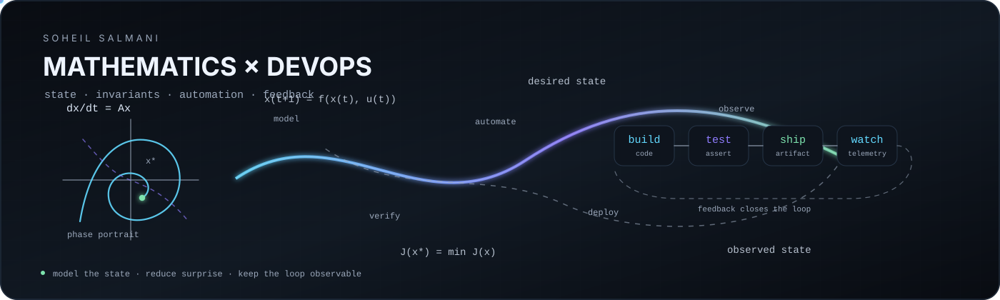

<picture>
  <source media="(prefers-color-scheme: dark)" srcset="assets/state-space-dark.svg">
  <source media="(prefers-color-scheme: light)" srcset="assets/state-space-light.svg">
  
</picture>

<p align="center">
  <a href="https://www.linkedin.com/in/soheil-salmani-822b89232"><b>LinkedIn</b></a>
  &nbsp;&nbsp;·&nbsp;&nbsp;
  <a href="https://soheilgtex.github.io"><b>Portfolio</b></a>
  &nbsp;&nbsp;·&nbsp;&nbsp;
  <a href="https://github.com/SoheilGtex?tab=repositories"><b>Repositories</b></a>
</p>

<br>

## State is the common language

I'm **Soheil Salmani**. I work in DevOps and study Mathematics and Applications at Kharazmi University.

The connection makes sense to me: mathematics trains you to care about **state, invariants, assumptions, edge cases, and convergence**. DevOps turns the same questions into **environments, pipelines, policies, telemetry, security, and recovery**. I like working in that overlap.

My background is broader than operations alone. I came through Python/backend work, technical leadership, data engineering, and analytics, so I tend to see infrastructure as part of a larger software and data system rather than a separate layer.

### Same questions, different language

| The question | In mathematics | In systems |
| --- | --- | --- |
| **What must stay true?** | invariants, constraints | policy, configuration, contracts |
| **How do we know it is behaving?** | stability, error, convergence | health checks, metrics, traces |
| **Can someone reproduce the result?** | method, assumptions | CI, containers, reproducible environments |
| **What happens at the boundary?** | edge cases, limiting behavior | failure modes, security boundaries |
| **What are we optimizing?** | objective under constraints | reliability, latency, cost, simplicity |

## Current state

<table>
<tr>
<td width="50%" valign="top">

**Work**

DevOps Engineer at **Fara-Ro**.

I work around Linux and Docker environments, CI/CD, application security, automated testing, deployment reliability, and Python/FastAPI-based systems.

</td>
<td width="50%" valign="top">

**Study**

B.Sc. student in **Mathematics and Applications** at Kharazmi University, while building a stronger Computer Science foundation.

I also serve as a Teaching Assistant and stay close to numerical analysis, probability, algorithms, scientific computing, and data-intensive systems.

</td>
</tr>
</table>

## The trajectory

```text
Python / backend
      ↓
technical leadership
      ↓
data engineering
      ↓
analytics
      ↓
DevOps / DevSecOps
```

Different titles, same preference: **understand the system first, then reduce surprise.**

## Working set

<table>
<tr>
<td width="33%" valign="top">

**Systems**

`Linux` `Docker` `Bash`  
`Git` `GitHub Actions` `CI/CD`  
`DevSecOps` `Application Security`

</td>
<td width="34%" valign="top">

**Software & data**

`Python` `FastAPI` `PostgreSQL`  
`SQL` `SQLAlchemy` `REST APIs`  
`Redis` `Prefect` `Pandas` `NumPy`

</td>
<td width="33%" valign="top">

**Mathematical computing**

`R` `MATLAB` `LaTeX`  
`Numerical Analysis` `Probability`  
`Linear Algebra` `Algorithms`

</td>
</tr>
</table>

<p align="center">
  <code>reproducible &gt; clever</code>&nbsp;&nbsp;
  <code>observable &gt; mysterious</code>&nbsp;&nbsp;
  <code>measured &gt; assumed</code>&nbsp;&nbsp;
  <code>recoverable &gt; fragile</code>
</p>

<details>
<summary><b>A little more context</b></summary>
<br>

At Kharazmi University, I support coursework across Programming with R, Mathematical Software, Probability I, and Statistical Methods. I also serve on the council of the Mathematics Scientific Association and participate in the university's Artificial Intelligence Association.

Before moving into DevOps, I worked across Python backend development, technical team leadership, financial data engineering, and analytics. That history still shapes how I approach infrastructure: data flow, application behavior, and operational reliability are usually the same system viewed from different angles.

</details>

---

<p align="center">
  <b>The pinned repositories carry the implementation detail.</b><br>
  <sub>LinkedIn has the chronology. This page is the mental model.</sub>
</p>
