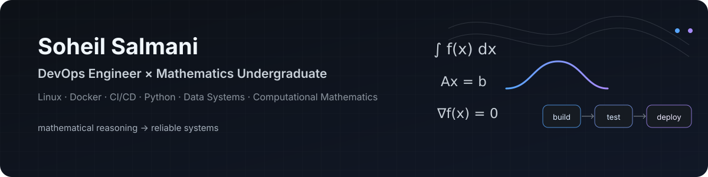

<picture>
  <source media="(prefers-color-scheme: dark)" srcset="assets/profile-hero-dark.svg">
  <source media="(prefers-color-scheme: light)" srcset="assets/profile-hero-light.svg">
  
</picture>

  <a href="https://www.linkedin.com/in/soheil-salmani-822b89232"><b>LinkedIn</b></a>
  &nbsp;·&nbsp;
  <a href="https://soheilgtex.github.io"><b>Portfolio</b></a>
  &nbsp;·&nbsp;
  <a href="https://github.com/SoheilGtex?tab=repositories"><b>Repositories</b></a>

## About

I'm a **DevOps Engineer at Fara-Ro** and an undergraduate in **Mathematics and Applications** at **Kharazmi University**, with a secondary focus on Computer Science.

My work has moved through Python/backend development, financial data engineering and analytics, and now DevOps/DevSecOps. I currently work with Linux and Docker environments, CI/CD, application security, automated testing, and deployment reliability.

What ties those areas together for me is systems thinking. I like using mathematical reasoning to understand complex problems, then building software and infrastructure that behave predictably in the real world.

### Right now

- Working as a **DevOps Engineer** at Fara-Ro, while continuing selected R&D work around financial analytics and data systems.
- Serving as a **Teaching Assistant at Kharazmi University** across Programming with R, Mathematical Software, Probability I, and Statistical Methods.
- Studying mathematics with growing interests in **algorithms, systems, scientific computing, numerical methods, optimization, and data-intensive computing**.

## Selected work

| Project | What I worked on |
| --- | --- |
| **[Math Research Radar](https://github.com/SoheilGtex/math-research-radar)** | A research-discovery/data platform built around **FastAPI, PostgreSQL, Celery, Redis, Docker, and Next.js**, with multi-source ingestion, background processing, API services, tests, and CI. |
| **[Finance Data Pipelines](https://github.com/SoheilGtex/finance-data-pipelines)** | A Python ETL project for financial data with CLI/configuration, structured transformations, tests/CI, Docker, and Parquet/SQLite outputs. |
| **R & Mathematical Software Laboratory** | Open-source educational infrastructure for Kharazmi University's R Programming and Mathematical Software courses, including GitHub-based assignment workflows and version-control practices. |
| **[Maclaurin Series for sin(x)](https://github.com/SoheilGtex/maclaurin-series-sin-matlab)** | A MATLAB project exploring approximation, convergence, error analysis, animation, and a non-analytic counterexample. |

<b>Earlier technical projects</b>

 

- **[Active Noise Cancelling](https://github.com/SoheilGtex/Active-Noise-Cancelling)** — Python-based microphone noise-suppression work using spectral subtraction and adaptive noise tracking.
- **[Voice Cloning / SV2TTS](https://github.com/SoheilGtex/Voice-Cloning-SV2TTS-)** — An early Python speech-synthesis project built around an SV2TTS workflow.
- **Asansafar** — Smart urban-mobility product work where I moved from Python development into technical team leadership and MVP delivery.

## Technical toolkit

**Infrastructure & delivery**  
`Linux` `Docker` `Git` `GitHub Actions` `CI/CD` `Bash` `DevOps` `DevSecOps` `Application Security` `Server Hardening`

**Backend & data systems**  
`Python` `FastAPI` `PostgreSQL` `SQL` `SQLAlchemy` `REST APIs` `Celery` `Redis` `Prefect` `Data Engineering` `ETL`

**Computational & quantitative**  
`Mathematics` `R` `MATLAB` `NumPy` `Pandas` `Scikit-learn` `LaTeX` `Statistical Data Analysis` `Mathematical Modeling`

## Academic foundation

**Kharazmi University**  
B.Sc. in **Mathematics and Applications** · Oct 2024 – Present

Selected completed coursework:

`Advanced Programming` · `Data Structures & Algorithms` · `Introductory Probability & Statistics` · `Linear Algebra` · `Mathematical Analysis` · `Numerical Analysis` · `Differential Equations` · `Combinatorics` · `Calculus I–II` · `Mathematical Software`

Alongside the degree, I'm strengthening my Computer Science foundation and exploring the overlap between mathematics, software systems, data infrastructure, and computational research.

## Experience in brief

- **DevOps Engineer · Fara-Ro** — Sep 2026 – Present
- **Analytics Engineer · Fara-Ro** — Apr 2026 – Sep 2026
- **Data Engineer · Fara-Ro** — Dec 2024 – Apr 2026
- **Teaching Assistant · Kharazmi University** — Jan 2026 – Present
- **Robotics & Programming Instructor · Mobtakeran Academy** — Jul 2025 – Oct 2025
- **Technical Manager · Asansafar Iranian** — Aug 2023 – Aug 2025
- **Python Developer · Asansafar Iranian** — Jun 2023 – Aug 2023

## Teaching & community

At Kharazmi University, I have supported courses in **Programming with R, Mathematical Software, Probability I, and Statistical Methods**. I also serve as an elected council member of the **Mathematics Scientific Association** and as a member of the **Artificial Intelligence Association**.

## Selected credentials

- **Fundamentals of Git with GitHub & GitLab**
- **CS50x · Harvard / CS50**
- **CS50x Puzzle Day · 2023, 2024, 2025**
- **Scientific Computing with Python · freeCodeCamp**
- **Data Analysis with Python · freeCodeCamp**
- **Machine Learning with Python · freeCodeCamp**

<b>Selected recognition</b>

 

- Top Inventor and Researcher · Pardis Technology Park · 2023, 2024
- Best Research Project · Crisis Management Headquarters · 2023
- Best Programming Project · SAMPAD Cultural and Artistic Competitions · 2022, 2023
- Best Programmer · 2022

## GitHub activity

<picture>
  <source media="(prefers-color-scheme: dark)" srcset="https://raw.githubusercontent.com/SoheilGtex/SoheilGtex/output/github-contribution-grid-snake-dark.svg">
  <source media="(prefers-color-scheme: light)" srcset="https://raw.githubusercontent.com/SoheilGtex/SoheilGtex/output/github-contribution-grid-snake.svg">
  
</picture>

---

  I work best where <b>mathematical thinking</b>, <b>software systems</b>, and <b>reliable infrastructure</b> meet.

